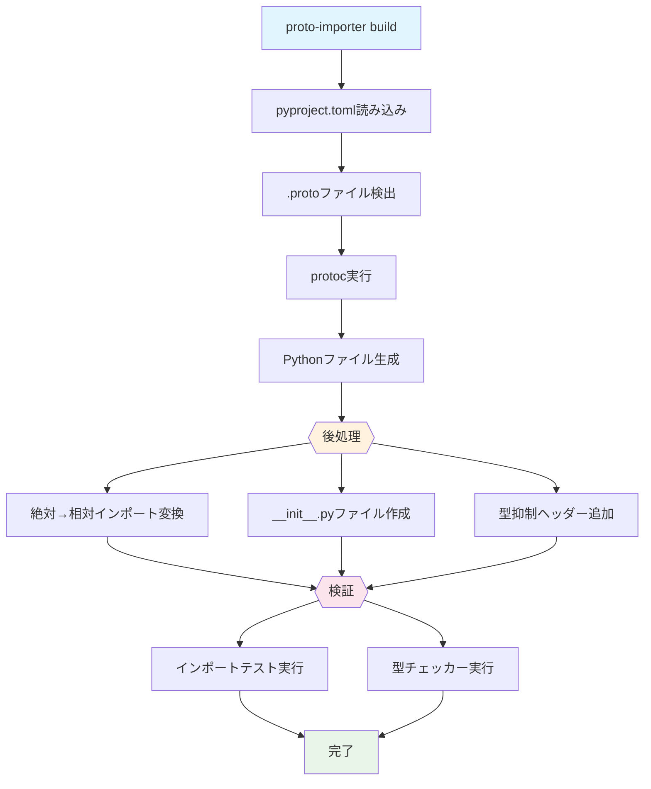
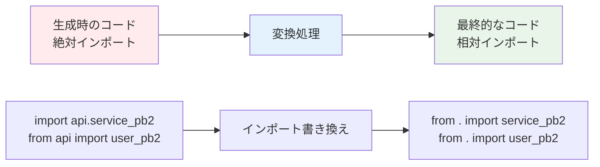

# python-proto-importer

[](https://crates.io/crates/python-proto-importer)
[](https://pypi.org/project/python-proto-importer/)
[](https://github.com/K-dash/python-proto-importer/actions)

Python 向け gRPC/Protobuf コード生成に本番レベルの信頼性をもたらす Rust 製 CLI ツール

**English:** [English Documentation](../README.md)

## python-proto-importer？
本ツールは以下の機能をサポートしています。

### 絶対インポート問題の解決

**根本的な問題:** 標準の`protoc`は Python ファイルを絶対インポート（例：`import foo.bar_pb2`）で生成します。これにより生成されたコードを別の場所に移動すると動作しなくなり、配置場所が限定されてしまいます。

**解決策:** `pyproject.toml`の設定に基づいて、すべてのインポートを自動的に相対インポートに変換します。これにより、生成されたコードを**プロジェクト内の任意の場所**に配置できるようになります。この問題を解決する OSS ツールは他にも存在しますが、本ツールは検証パイプライン全体とシームレスに統合された形でこの機能を提供します。

### 品質保証を内蔵

標準の protoc ワークフローとは異なり、このツールは**生成されたコードがプロジェクトに届く前に検証します**。
mypy-protobuf や複雑な proto 定義が不正なスタブを生成しても、CI が失敗してから気づくのではなく、即座に問題を検知できます。

### 明確なエラー境界

**生成時エラー vs. 利用時エラー**の違いを明確にします。

- ✅ ツール成功 = 生成されたコードは有効
- ❌ ツール失敗 = 生成プロセスの問題（これはアプリケーション側の問題ではない）
- 📊 後で型チェッカーが失敗 = 生成されたコードを利用するアプリケーション側の問題

このツールは、protobuf 検証専用に調整された独自の型チェック設定を維持し、プロジェクト設定に関係なく一貫した品質を保証します。

### 高速なパフォーマンス

**Rust**で実装されているため、最高のパフォーマンスを実現。ファイル操作、インポート書き換え、検証がネイティブスピードで実行され、大規模なコードベースや CI/CD パイプラインでも高速に動作します。

## クイックスタート

### インストール

```bash
# pip経由（推奨）
pip install python-proto-importer

# cargo経由
cargo install python-proto-importer
```

### 基本セットアップ

1. `pyproject.toml`に設定を記述：

```toml
[tool.python_proto_importer]
inputs = ["proto/**/*.proto"]  # protoファイル
out = "generated"              # 出力ディレクトリ
```

2. Python コードを生成：

```bash
proto-importer build
```

これだけで、生成されたコードは検証済みの状態ですぐに使用できます。

## 主要機能

### スマートなインポート管理

- **自動相対インポート**: 生成されたコードは相対インポートを使用し、異なるプロジェクト構造でも移植可能
- **インテリジェントな書き換え**: protobuf インポートのみを変更し、`google.protobuf`などの外部依存は保持

### パッケージ構造制御

- **自動`__init__.py`生成**: インポートを壊す init ファイルの欠落を防止
- **名前空間パッケージサポート**: 必要に応じて PEP 420 に完全対応

### コード生成後における包括的な検証

- **インポート検証**: 生成後、生成されたすべてのモジュールをテストインポート
- **型チェック**: 設定オプションでの mypy/pyright 検証
- **事前チェック**: `proto-importer doctor`で実行環境を診断

### プロダクション対応のワークフロー

- **単一コマンド**: 生成、後処理、検証を 1 ステップで実行
- **宣言的設定**: すべての設定を`pyproject.toml`に集約
- **CI/CD フレンドリー**: 自動化を前提に設計

## コマンド

### `proto-importer build`

proto ファイルから Python コードを生成し、完全な検証パイプラインを実行。

```bash
proto-importer build                  # 標準ビルド
proto-importer build --no-verify      # 検証をスキップ
proto-importer build --pyproject custom.toml  # カスタム設定
```

### `proto-importer doctor`

環境を診断し、依存関係をチェック。

```bash
proto-importer doctor
```

出力内容は以下です。

- Python 環境（python/uv）
- 必須依存関係（grpcio-tools）
- オプションツール（mypy-protobuf、mypy、pyright）
- 不足コンポーネントの有用なヒント

### `proto-importer check`

検証のみ実行（生成なし）。

```bash
proto-importer check
```

### `proto-importer clean`

生成された出力ディレクトリを削除。

```bash
proto-importer clean --yes
```

## ⚙️ 設定

すべての設定は`pyproject.toml`の`[tool.python_proto_importer]`セクションに記述します。

### 基本オプション

| オプション   | 型     | デフォルト           | 説明                                                   |
| ------------ | ------ | -------------------- | ------------------------------------------------------ |
| `inputs`     | array  | `[]`                 | コンパイルする proto ファイルの Glob パターン          |
| `out`        | string | `"generated/python"` | 生成ファイルの出力ディレクトリ                         |
| `include`    | array  | `["."]`              | Proto インポートパス（protoc の`--proto_path`）        |
| `python_exe` | string | `"python3"`          | Python 実行ファイル（`"python3"`、`"python"`、`"uv"`） |

### 型スタブ生成

| オプション  | 型      | デフォルト | 説明                                   |
| ----------- | ------- | ---------- | -------------------------------------- |
| `mypy`      | boolean | `false`    | mypy-protobuf 経由で`.pyi`スタブを生成 |
| `mypy_grpc` | boolean | `false`    | gRPC スタブ（`_grpc.pyi`）を生成       |

### 後処理オプション

`[tool.python_proto_importer.postprocess]`で設定：

| オプション         | 型      | デフォルト | 説明                                      |
| ------------------ | ------- | ---------- | ----------------------------------------- |
| `relative_imports` | boolean | `true`     | 相対インポートに変換                      |
| `create_package`   | boolean | `true`     | `__init__.py`ファイルを作成               |
| `exclude_google`   | boolean | `true`     | `google.protobuf`インポートを書き換えない |
| `pyright_header`   | boolean | `false`    | Pyright 抑制ヘッダーを追加                |

### 検証オプション

`[tool.python_proto_importer.verify]`で設定。

```toml
[tool.python_proto_importer.verify]
mypy_cmd = ["mypy", "--strict", "generated"]
pyright_cmd = ["pyright", "generated/**/*.pyi"]
```

## 設定例

### 最小セットアップ

```toml
[tool.python_proto_importer]
inputs = ["proto/**/*.proto"]
out = "generated"
```

### 型チェック付き本番セットアップ

```toml
[tool.python_proto_importer]
backend = "protoc"
python_exe = "uv"  # または ".venv/bin/python"
include = ["proto"]
inputs = ["proto/**/*.proto"]
out = "src/generated"
mypy = true
mypy_grpc = true

[tool.python_proto_importer.postprocess]
relative_imports = true
create_package = true
exclude_google = true

[tool.python_proto_importer.verify]
# 生成された.pyファイルのノイズを避けるため.pyiファイルにフォーカス
pyright_cmd = ["uv", "run", "pyright", "src/generated/**/*.pyi"]
mypy_cmd = ["uv", "run", "mypy", "--strict", "src/generated"]
```

### 名前空間パッケージ（PEP 420）

```toml
[tool.python_proto_importer]
inputs = ["proto/**/*.proto"]
out = "generated"

[tool.python_proto_importer.postprocess]
create_package = false  # __init__.pyファイルを作成しない
```

## `include`と`inputs`の違いを理解する

include と inputs は重要な概念となります。

### `include` - 検索パス

protoc が`.proto`ファイルとその依存関係を探す場所。

### `inputs` - コンパイル対象

実際にコンパイルする`.proto`ファイル（Glob パターン）。

### 構造例

```
project/
├── pyproject.toml           # 設定ファイル（ここが基準点）
├── api/
│   └── service.proto        # コンパイル対象
├── third_party/
│   └── google/
│       └── api/
│           └── annotations.proto  # 依存関係（これはコンパイルしない）
└── generated/               # ここに出力
```

### 正しい設定

```toml
[tool.python_proto_importer]
include = [".", "third_party"]  # すべてのprotoを見れる
inputs = ["api/**/*.proto"]      # 指定したprotoだけコンパイル
out = "generated"
```

### 重要

依存関係は`include`に含める必要があります（protoc が見つけられるように）が、`inputs`には含めません（再生成したくないので）。

## 高度な使い方

### uv との連携

`python_exe` には、[uv](https://github.com/astral-sh/uv)を指定可能です。

```toml
[tool.python_proto_importer]
python_exe = "uv"

[tool.python_proto_importer.verify]
mypy_cmd = ["uv", "run", "mypy", "--strict", "generated"]
pyright_cmd = ["uv", "run", "pyright", "generated"]
```

### CI/CD 統合の設定例

#### GitHub Actions

```yaml
- name: セットアップ
  run: |
    pip install python-proto-importer grpcio-tools mypy-protobuf

- name: Proto生成
  run: proto-importer build

- name: テスト実行
  run: pytest tests/
```

#### Pre-commit フック

```yaml
repos:
  - repo: local
    hooks:
      - id: proto-build
        name: Protoファイルのビルド
        entry: proto-importer build
        language: system
        files: \.proto$
```

## トラブルシューティング

### 生成後のインポートエラー

1. パッケージ構造をチェックします。

   ```bash
   proto-importer check
   ```

2. `include`パスがすべての依存関係をカバーしているか確認してください。

3. `PYTHONPATH`が出力ディレクトリの親を含んでいるか確認してください。

### 型チェッカーの警告

動的属性を持つ生成された`.py`ファイルの場合、`.pyi`ファイルに型チェックをフォーカスします。

```toml
[tool.python_proto_importer.verify]
pyright_cmd = ["pyright", "generated/**/*.pyi"]  # スタブのみチェック
```

### "Shadowing"エラー

同名ファイルを持つ複数の`include`パスを使用する場合に発生します。解決策としては以下を検討してください。

- より具体的な`inputs`パターンを使用
- 名前の競合を避けるため proto ファイルを再構造化

## 📊 動作の仕組み

ツールは信頼性の高いコード生成を保証するために、包括的なパイプラインに従います。



### インポート変換の例



### 主要なステップ

1. **生成** - 設定に従って`protoc`を実行
2. **後処理**
   - 絶対インポートを相対に変換
   - `__init__.py`ファイルを作成
   - 設定に応じて型チェッカー抑制を追加
3. **検証**
   - すべての生成モジュールのインポートを試行
   - 設定された型チェッカーを実行
   - 明確で実行可能なエラーを報告

## 🚧 現在の制限事項

- **v0.1**: `protoc`バックエンドのみ（buf 対応は v0.2 で予定）
- インポート書き換えは一般的なパターン（`_pb2.py`、`_pb2_grpc.py`、`.pyi`ファイル）をカバー
- インポート検証は`.py`ファイルのみチェック（`.pyi`は型チェッカー経由で検証）

## コントリビューション

コントリビューションを歓迎します！開発セットアップについては[CONTRIBUTING.md](../CONTRIBUTING.md)を参照してください。

### クイック開発セットアップ

```bash
# 開発依存関係をインストール
cargo install cargo-make

# 完全な検証を実行
makers all  # format、lint、build、testを実行

# または個別に
makers format
makers lint
makers test
```

## ライセンス

[Apache-2.0](../LICENSE)
