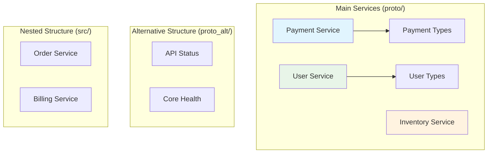

# E2E Testing for python-proto-importer

This directory contains comprehensive end-to-end tests for the python-proto-importer tool, validating the entire workflow from protobuf compilation to Python import verification across various configurations.

## Overview

The E2E test suite verifies that the python-proto-importer can:

- Generate Python code from proto files using different configurations
- Handle complex proto dependencies and imports
- Support various Python executables (python3, uv, custom paths)
- Generate optional type stubs (.pyi files)
- Apply postprocessing transformations (relative imports, **init**.py creation)
- Verify generated code can be imported successfully

## Directory Structure

```
python_e2e/
|-- configs/              # Test configuration files
|-- proto/                # Main proto files for testing
|   |-- inventory/        # Inventory service (standalone)
|   |-- payment/          # Payment service (with internal types)
|   `-- user/             # User service (with internal types)
|-- proto_alt/            # Alternative proto structure for path testing
|-- src/                  # Nested proto files for structure testing
|-- tests/                # Test implementations
`-- pyproject.toml        # Python project configuration
```

## Proto File Architecture

The test suite uses a realistic microservices architecture to test complex scenarios:



### Why Multiple Proto Files?

The test suite uses multiple proto files to validate:

1. **Import Dependencies**: `payment.proto` imports `payment/types.proto`, testing cross-file references
2. **Package Structures**: Different services use different packages (`payment.v1`, `user.v1`, `inventory.v1`)
3. **Relative Import Generation**: Tests conversion of absolute imports to relative imports
4. **Directory Hierarchies**: Multiple levels of nesting test path resolution
5. **Real-world Scenarios**: Mirrors actual microservices architectures

## Test Configurations

The `configs/` directory contains 13 different configuration files testing various scenarios:

| Configuration                   | Purpose                 | Key Features                                     |
| ------------------------------- | ----------------------- | ------------------------------------------------ |
| `config_minimal.toml`           | Basic functionality     | Minimal settings, no type stubs                  |
| `config_full.toml`              | Complete feature set    | All features enabled (mypy, grpc stubs, pyright) |
| `config_mypy_only.toml`         | Type stub generation    | Only mypy protobuf stubs                         |
| `config_no_package.toml`        | Namespace packages      | No **init**.py files (PEP 420)                   |
| `config_uv_python_exe.toml`     | uv support              | Tests uv as Python executable                    |
| `config_custom_out.toml`        | Custom output paths     | Non-standard output directory                    |
| `config_different_include.toml` | Include path variations | Multiple include directories                     |
| `config_relative_paths.toml`    | Path handling           | Relative path configurations                     |
| `config_selective_inputs.toml`  | Selective compilation   | Specific proto file patterns                     |
| `config_nested_out.toml`        | Nested outputs          | Deep directory structures                        |
| `config_src_structure.toml`     | Source layouts          | src/ directory patterns                          |
| `config_alt_proto_path.toml`    | Alternative paths       | proto_alt/ directory testing                     |
| `config_empty_include.toml`     | Default behaviors       | Empty include array handling                     |

## Test Implementation

### Core Test Structure

The main test function `test_with_config` is parametrized to run against all configurations:

```python
@pytest.mark.parametrize("config_name,expected", [
    ("config_minimal", {...}),
    ("config_full", {...}),
    # ... more configurations
])
def test_with_config(config_name, expected):
    # 1. Load configuration
    # 2. Run python-proto-importer build
    # 3. Verify file structure
    # 4. Validate type stubs
    # 5. Check postprocessing results
```

### Verification Steps

Each test performs comprehensive verification:

1. **File Generation**: Ensures all expected .py and .pyi files are created
2. **Structure Validation**: Verifies directory layout matches configuration
3. **Type Stub Checking**: Confirms mypy/grpc stub generation when enabled
4. **Import Testing**: Validates all generated modules can be imported
5. **Postprocessing Verification**: Checks **init**.py creation and relative imports

### Python Executable Testing

Special attention is given to testing different Python executables:

- **python3**: Standard system Python
- **uv**: Modern Python package manager with `uv run python -m` syntax
- **.venv/bin/python**: Virtual environment paths

## Running Tests

```bash
# Run all E2E tests
uv run pytest tests/test_generate_and_verify.py -v

# Run specific configuration test
uv run pytest tests/test_generate_and_verify.py -k "config_uv_python_exe" -v

# Run with cleanup verification
uv run pytest tests/test_generate_and_verify.py --tb=short
```

## Test Data Rationale

### Service Domains

- **Payment Service**: Financial transactions with status enums and type safety
- **User Service**: User management with roles and authentication
- **Inventory Service**: Product catalog and stock management
- **Order Service**: E-commerce order processing
- **Billing Service**: Invoice and payment tracking

### Cross-Service Dependencies

The proto files intentionally avoid cross-service imports to test:

- Independent compilation units
- Package isolation
- Relative import transformations within services
- Clean separation of concerns

This architecture validates that python-proto-importer correctly handles real-world microservices protobuf patterns while maintaining clean, importable Python code generation.

## Maintenance Notes

- **Config Files**: Keep configuration variants minimal but comprehensive
- **Proto Changes**: Maintain backward compatibility when updating proto definitions
- **Test Data**: Use realistic but simple service definitions
- **Verification**: Always test both generation and import success

The E2E test suite ensures python-proto-importer reliably handles diverse protobuf projects from simple single-service setups to complex multi-service architectures.
